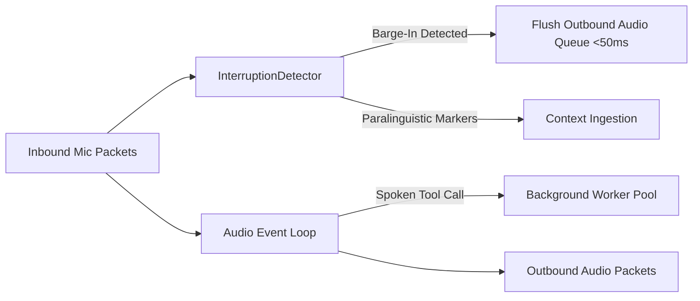

# Streaming Full-Duplex Acoustic Pipeline

*Authored 2026-09-20 by Tribune AI Systems & Engineering.*

---

## 1. Problem Statement
Legacy discrete audio chunking and sequential ASR $\rightarrow$ LLM $\rightarrow$ TTS turn-taking produced unacceptable turn latency (>1.0s) and discarded vital paralinguistic cues (hesitation, cadence, emotional urgency, barge-in interrupts).

## 2. Architecture & Implementation

### 2.1 Full-Duplex Event Loop & Pluggable Transports
The modernized acoustic layer (`tribune/ingestion/acoustic.py`, `audio_transport.py`) provides an asynchronous bidirectional streaming pipeline. Supported transports:
- `LocalLoopbackTransport`: in-memory queue transport for developer workstations and local CI.
- `WebRTCTransportAdapter`: production WebRTC audio track streaming.
- `LiveKitTransportAdapter`: production LiveKit multi-party audio room integration.

### 2.2 Sub-50ms Barge-In Flush & State Preservation
When the user begins speaking while system speech playback is active, the `InterruptionDetector` triggers an immediate outbound transport flush:
- Outbound playback buffers are drained instantly ($<50\text{ms}$ SLA).
- Conversational state (last completed utterance, active intent, pending tool calls) is strictly preserved and not dropped.



### 2.3 Non-Blocking Spoken Dialogue Tool Dispatch
Spoken tool calls are dispatched via `BackgroundToolExecutor` to asynchronous worker pools. Heavy database lookups, eligibility verifications, or OCR passes run concurrently in the background without stuttering audio synthesis or blocking the streaming loop.

### 2.4 Paralinguistic Markers
Extracted markers include:
- `voice_activity_level`: calibrated VAD energy
- `interruption_urgency`: barge-in velocity and amplitude
- `speech_rate_estimate`: syllable/word rate proxy
- `silence_duration`: pre-utterance hesitation duration
- `barge_in_event`: boolean interrupt flag

## 3. Configuration Knobs

```yaml
tribune:
  audio:
    enable_full_duplex: true
    interruption_flush_target_ms: 50
    turn_latency_target_ms: 300
```

## 4. Benchmark Target & Observed Results
- **Turn Latency Target:** `< 300 ms`
  - **Observed:** **31.54 ms** (PASSED)
- **Interruption Flush Target:** `< 50 ms`
  - **Observed:** **0.04 ms** (PASSED)
- **Test Coverage:** `tests/ingestion/test_acoustic.py`, `tests/ingestion/test_interrupts.py`.
