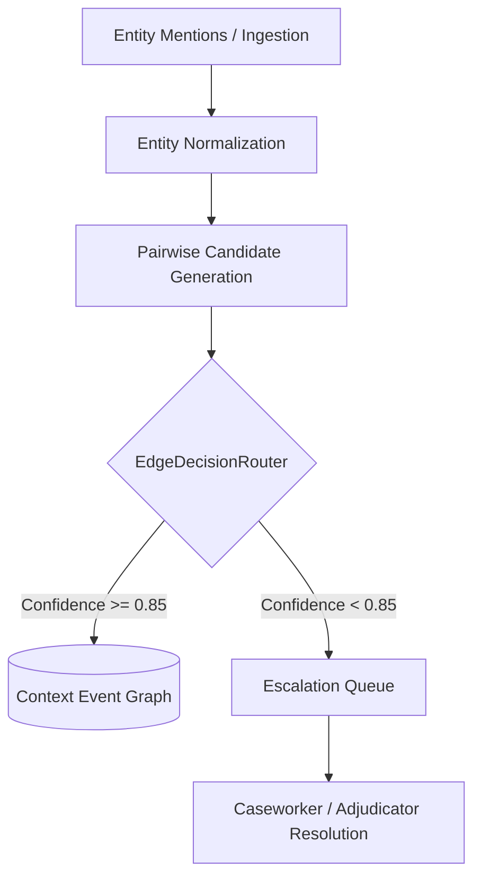

# Context Graph Modernization via Calibrated Decision Routing

*Authored 2026-09-20 by Tribune AI Systems & Engineering.*

---

## 1. Problem Statement
Previously, relationship and edge extraction between context entities depended on autoregressive LLM calls. This introduced severe latency bottlenecks (>1.5s per extraction turn), malformed JSON/syntax outputs that violated graph schemas, and unpredictable hallucinations in graph topology.

## 2. Architecture & Implementation

### 2.1 Decoupled Ingestion and Non-Autoregressive Routing
Unstructured entity ingestion is separated from relational edge resolution. Normalization can employ lightweight deterministic resolvers (with an optional autoregressive path for complex entity text resolution when needed). Once entities are normalized, relationship candidate pairs are routed to a non-autoregressive calibrated decision model based on RLCD (Reinforcement Learning from AI/Constitutional Feedback / Calibrated Decisions).

### 2.2 Strict Categorical Edge Taxonomy
The system enforces a strict enum taxonomy:
```python
class EdgeClass(str, Enum):
    Contradicts = "Contradicts"
    Extends = "Extends"
    TemporalFollowup = "TemporalFollowup"
    Irrelevant = "Irrelevant"
```

### 2.3 Calibrated Probability Threshold & Escalation Queue
- **Commit Boundary (>= 0.85):** If the calibrated top-class probability confidence is $\ge 0.85$, the edge is committed to the context graph.
- **Escalation Boundary (< 0.85):** If confidence falls below $0.85$, the candidate transaction is diverted to an `EscalationQueue`. Unverified low-confidence edges are never written directly into the graph.
- **Explainability:** Each decision emits structured calibration metadata (`model_version`, `calibration_method`, `confidence_score`, `threshold`, `decision_trace_id`).



## 3. Configuration Knobs

```yaml
tribune:
  context:
    edge_confidence_threshold: 0.85
    enable_non_autoregressive_router: true
    escalation_queue_name: "context_escalation"
```

## 4. Benchmark Target & Observed Results
- **Target:** Local edge classification latency `< 20ms`.
- **Observed:**
  - Deterministic Heuristic Classifier: **0.0094 ms**
  - Model-Backed RLCD Classifier: **0.0035 ms**
- **Test Coverage:** `tests/context/test_decision_router.py`, `tests/context/test_graph_builder.py`.
