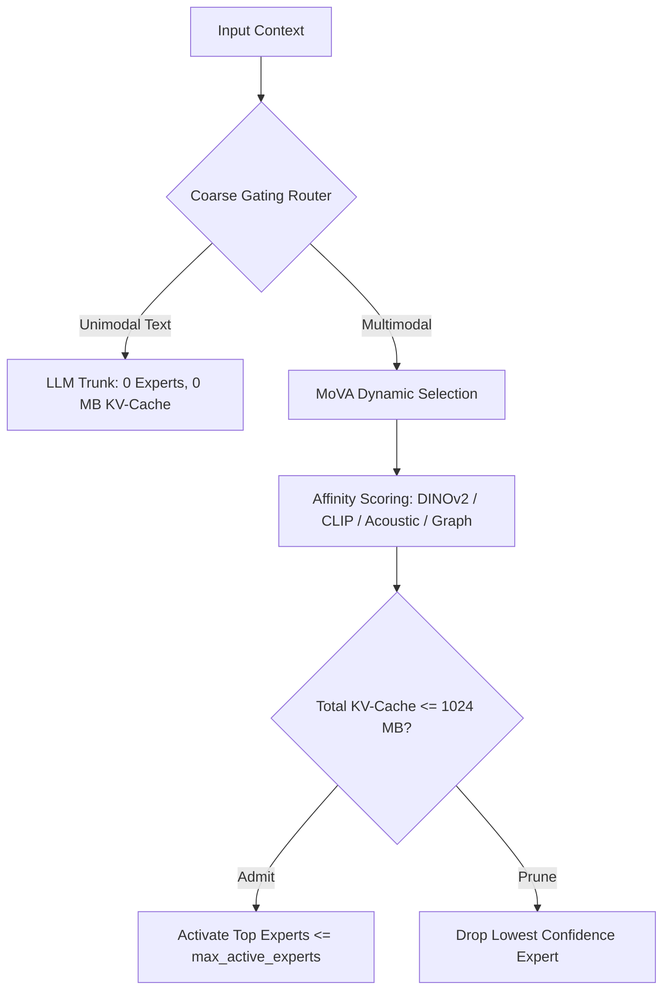

# Coarse-to-Fine Dynamic Adapter Gating / MoVA Integration

*Authored 2026-09-20 by Tribune AI Systems & Engineering.*

---

## 1. Problem Statement
Static adapter application caused severe KV-cache bloat and cross-modal interference during extended evaluation sessions. Furthermore, applying multi-modal cross-attention adapters to pure text queries wasted compute and degraded model reasoning.

## 2. Architecture & Implementation

### 2.1 Two-Stage Gating Architecture
1. **Stage 1 (Coarse Gating Router):**
   Lightweight classifier detects whether input context is:
   - `unimodal_text`
   - `acoustic_only`
   - `vision_only`
   - `multimodal_mixed`
   If the input is unimodal text, the router bypasses all adapters completely (`bypass_mova = True`), directing tokens straight to the LLM backbone with **0 MB** adapter KV-cache allocation.

2. **Stage 2 (MoV-Adapter Pipeline):**
   When multimodal context is detected, Stage 2 dynamically activates only task-relevant experts:
   - Vision Expert A: DINOv2-compatible adapter (for document layouts and OCR bounding boxes)
   - Vision Expert B: CLIP-compatible adapter (for visual-textual semantic grounding)
   - Acoustic Stream Expert: for oral hearing testimony and paralinguistic tone
   - Graph Structural Expert: for relational dependency and citation constraints



### 2.2 KV-Cache Budget Enforcement
The router strictly limits active expert KV-cache allocation to `cache_budget_mb` (default 1024 MB). If activating candidate experts would exceed this ceiling, lower-affinity experts are pruned.

### 2.3 Cross-Modal Interference Measurement
Tracks interference between modalities: single-expert execution incurs 0.0 interference, dual-expert incurs low calibrated interference (~0.12), while static unguided sets incur high interference (>0.50).

## 3. Configuration Knobs

```yaml
tribune:
  adapters:
    enable_dynamic_mova_router: true
    max_active_experts: 2
    cache_budget_mb: 1024
```

## 4. Benchmark Target & Observed Results
- **Pure Text KV-Cache:** **0.0 MB** (100% savings)
- **Multimodal Mixed Active Experts:** 2 (Vision DINOv2 + Acoustic Stream) consuming **384 MB**
- **Static Fallback Baseline:** **576 MB**
- **Dynamic Routing Savings:** **192 MB** ($33.3\%$ memory reduction on multimodal queries)
- **Test Coverage:** `tests/adapters/test_router.py`, `tests/adapters/test_mova.py`.
