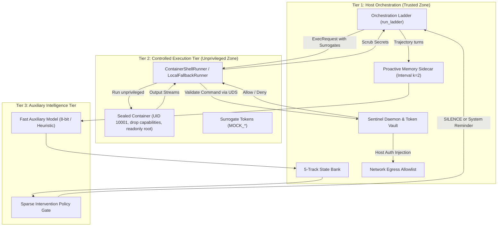

# Tribune Hardened Three-Tier Evaluation Architecture

This document provides architectural documentation, configuration reference, and operational guides for the hardened three-tier evaluation harness in Tribune.

---

## 1. Architectural Overview



### Architecture Zones
1. **Tier 1 — Host Tier:**
   - Runs evaluation ladder orchestration (`ladder.py`).
   - Hosts the Sentinel security daemon listening over a local Unix domain socket (`/tmp/tribune_sentinel.sock`).
   - Hosts the Proactive Memory sidecar engine and manages state banks.
   - Holds authentic API keys and credentials strictly out-of-band in host memory.
2. **Tier 2 — Controlled Execution Tier:**
   - Containerized runtime (`ContainerShellRunner`) or isolated subprocess (`LocalFallbackRunner`).
   - Runs as non-root user (`tribune-sandbox` / UID 10001) with dropped Linux capabilities (`--cap-drop=ALL`).
   - Environment variables contain exclusively synthetic surrogate tokens (`MOCK_ACCESS_HANDLE_ALPHA`, `MOCK_API_KEY_BRAVO`, etc.).
   - Network egress is deny-by-default; outbound calls are mediated by Sentinel.
3. **Tier 3 — Auxiliary Intelligence Tier:**
   - Evaluates a 5-track operational state bank:
     - `current_environment`: working directory, paths, visible files
     - `successful_mutations`: verified file modifications, created artifacts, passed tests
     - `unmet_task_requirements`: missing artifacts, unsatisfied verification checks
     - `active_subgoals`: operational hypotheses and next commands
     - `failed_commands_cache`: non-zero exit traces, recurrence fingerprints
   - Sparse, policy-gated interventions prevent degraded quantized models from looping or declaring premature completion while returning explicit silence (`SILENCE`) by default.

---

## 2. Configuration Reference

Configuration is managed centrally via `tribune/eval/quant_sensitivity/hardening_config.py` and supports precedence:  
**Runtime Arguments > Environment Variables > YAML/JSON Config File > Safe Defaults**.

### Environment Variables

| Variable | Values | Default | Description |
|---|---|---|---|
| `TRIBUNE_EXECUTION_MODE` | `container`, `local_fallback`, `legacy`, `auto` | `auto` | Selects shell runner backend. |
| `TRIBUNE_SENTINEL_ENABLED` | `true`, `false` | `true` | Enables Sentinel socket daemon interception. |
| `TRIBUNE_SENTINEL_SOCKET_PATH` | Path | `/tmp/tribune_sentinel.sock` | Path to Unix Domain Socket. |
| `TRIBUNE_ALLOWLIST_PATH` | Path | `config/sentinel_allowlist.yaml` | YAML file with egress rules. |
| `TRIBUNE_SURROGATE_TOKEN_PREFIX` | String | `MOCK_` | Prefix for synthetic handles. |
| `TRIBUNE_CONTAINER_IMAGE` | Docker Tag | `tribune-sandbox:latest` | Sandboxed runtime container image. |
| `TRIBUNE_CONTAINER_USER` | String / UID | `tribune-sandbox` | Non-root sandbox user. |
| `TRIBUNE_CONTAINER_NETWORK_MODE` | `none`, `sentinel_proxy` | `none` | Network sandboxing mode. |
| `TRIBUNE_MEMORY_SIDECAR_ENABLED` | `true`, `false` | `true` | Enables Proactive Memory sidecar. |
| `TRIBUNE_MEMORY_UPDATE_INTERVAL_K`| Integer | `2` | Update state bank every k turns. |
| `TRIBUNE_MEMORY_AUX_BACKEND` | `heuristic_fast`, `local_8bit`, `api` | `heuristic_fast` | Auxiliary intelligence path. |
| `TRIBUNE_MEMORY_MIN_CONFIDENCE` | Float [0.0, 1.0] | `0.70` | Min confidence threshold for intervention. |
| `TRIBUNE_MEMORY_MAX_INTERVENTIONS`| Integer | `5` | Max interventions per task budget cap. |

---

## 3. How to Run Hardened Evaluation

### Standard Evaluation Run
```bash
# Execute evaluation ladder with full three-tier hardening
export TRIBUNE_EXECUTION_MODE=auto
export TRIBUNE_SENTINEL_ENABLED=true
export TRIBUNE_MEMORY_SIDECAR_ENABLED=true
pytest tests/test_hardened_integration_smoke.py
```

### Running with Docker Container Isolation
```bash
export TRIBUNE_EXECUTION_MODE=container
export TRIBUNE_CONTAINER_IMAGE=tribune-sandbox:latest
pytest tests/test_quant_sensitivity.py
```

### Running in Legacy Mode (Baseline Comparison)
```bash
export TRIBUNE_EXECUTION_MODE=legacy
export TRIBUNE_SENTINEL_ENABLED=false
export TRIBUNE_MEMORY_SIDECAR_ENABLED=false
pytest tests/test_quant_sensitivity.py
```

---

## 4. How to Interpret New Evaluation Reports

Hardened evaluation runs generate three reporting artifacts in `docs/eval_notes/`:
1. `eval_note_hardened.md`: Publishable markdown eval note.
2. `hardened_metrics.json`: Machine-readable JSON telemetry.
3. `hardened_metrics.csv`: Comparative spreadsheet.

### Key Metrics
- **Total Turns ($T$):** Total model-runner interaction turns across cases.
- **Interventions Count:** Number of sparse interventions triggered by the sidecar.
- **Avoided Loops Count:** Number of redundant catastrophic command loops prevented.
- **Aux Invocations:** Invocations of the auxiliary model (every $k=2$ turns).
- **Net Trajectory Efficiency Score:**  
  $$net\_eff = 0.40 \cdot \text{completion} + 0.30 \cdot (1 - \text{loop\_rate}) + 0.20 \cdot \frac{\text{base\_turns}}{T} - 0.10 \cdot \text{overhead\_ratio}$$
  Higher score indicates superior cost-reliability trade-off.

---

## 5. How to Run Test Suites

```bash
# Run all hardened architecture test suites
.venv/bin/pytest \
  tests/test_sentinel_hardened.py \
  tests/test_runtime_runners.py \
  tests/test_proactive_memory_sidecar.py \
  tests/test_dual_agent_costmodel.py \
  tests/test_hardened_report.py \
  tests/test_hardened_integration_smoke.py
```

---

## 6. Security Caveats & Known Limitations

1. **Host-Side Secret Scrubbing:** While `TokenBroker` redacts all known secrets and standard credential regex patterns, non-standard proprietary secret formats should be explicitly registered via `token_broker.register_secret()`.
2. **Local Fallback Mode:** In environments without Docker (`local_fallback`), process isolation uses subprocess sandbox constraints. `unsafe_for_production=True` is recorded in metadata to prevent accidental production deployment without containerization.
3. **Deny-by-Default Egress:** Sandboxed code cannot reach external URLs unless an entry is present in `config/sentinel_allowlist.yaml`.
