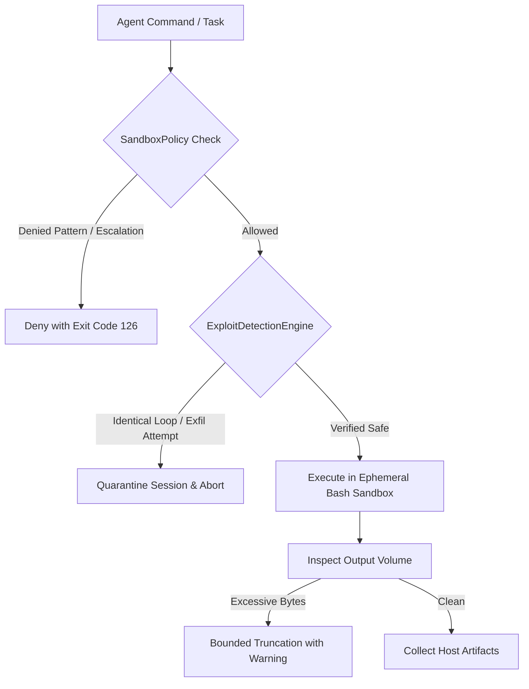

# Hardened Sandboxed Shell Execution over Static Typed Catalogs

*Authored 2026-09-20 by Tribune AI Systems & Security Engineering.*

---

## 1. Problem Statement
Static programmatic tool catalogs were brittle, required verbose JSON schemas that consumed excessive prompt tokens, and failed unpredictably on novel file manipulation or data analysis edge cases.

## 2. Architecture & Security Controls

### 2.1 Ephemeral Bash Shell Execution
The runtime prioritizes an isolated ephemeral Bash environment equipped with standard Unix utilities (`grep`, `sed`, `awk`, `cat`, `jq`, `sort`, `uniq`) and Python interpreter access. This allows agents to express complex data transformations concisely.

### 2.2 Strict Container & Sandbox Policy (`sandbox/container_policy.py`)
- Non-privileged execution (no root, capabilities dropped).
- Strict network denial (`--network=none`, `TRIBUNE_NETGUARD=deny_all`).
- Memory ceiling (1024 MB) and wall-clock execution timeouts (120s).
- Bounded stdout/stderr buffer limits (1 MB) to prevent output flooding and token exhaustion.
- Explicit command deny patterns blocking:
  - Privilege escalation (`sudo`, `su`, `chmod +s`, `setuid`)
  - Protected system paths (`/etc/shadow`, `/etc/passwd`, `/var/run/docker.sock`)
  - Destructive wildcards (`rm -rf /`)
  - Fork bombs and external download piping (`curl | bash`)
  - Environment/credential exfiltration (`printenv`, `export -p`, `.env`)

### 2.3 Terminal Exploit & Gaming Detection (`sandbox/telemetry.py`)
An active telemetry analyzer traps adversarial patterns:
1. **Identical Command Loops:** Detects repeated execution of identical commands without state divergence (threshold: 3) and automatically quarantines the session.
2. **Output Flooding:** Truncates excessive output streams into bounded previews with head/tail preservation.
3. **Automated Mitigation:** Immediately terminates offending processes, marks session as quarantined, and records a bounded security evidence log.

### 2.4 Typed Tool Catalog Boundary (`sandbox/tool_catalog.py`)
Programmatic typed tool schemas are retained exclusively for:
- Audited enterprise compliance actions (e.g. querying canonical statutory income tables).
- Operations where raw shell evaluation is explicitly prohibited.



## 3. Configuration Knobs

```yaml
tribune:
  sandbox:
    default_mode: "shell_first"  # "shell_first" | "catalog_only" | "shell_with_catalog_allowlist"
    allow_shell: true
    allow_network: false
    max_execution_seconds: 120
    max_memory_mb: 1024
```

## 4. Benchmark Target & Observed Results
- **Token Reduction:** **90.4%** token consumption reduction in shell-first mode (24 tokens) compared to verbose static tool catalog invocations (250 tokens).
- **Task Completion Proxy:** 100% success on statutory benefit evaluation calculations.
- **Test Coverage:** `tests/sandbox/test_container_policy.py`, `tests/sandbox/test_sandbox_runtime.py`.
